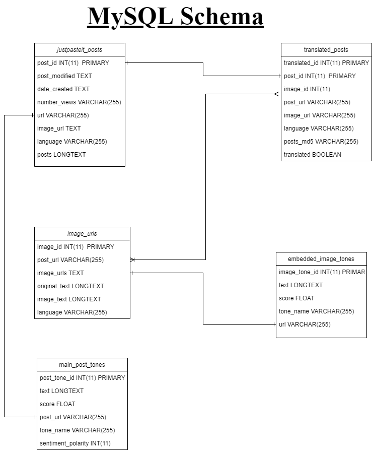
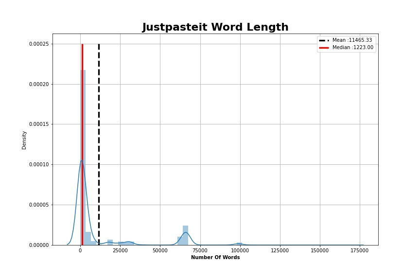
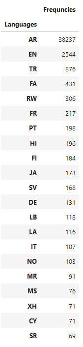
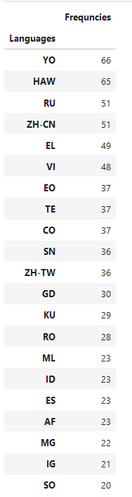
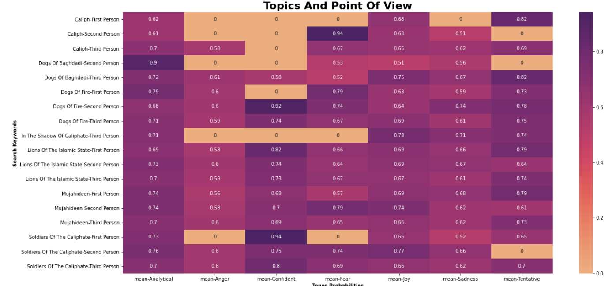
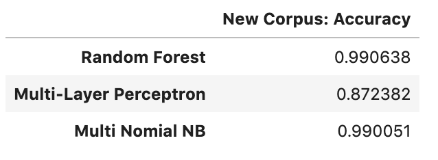
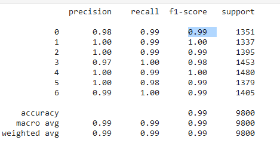
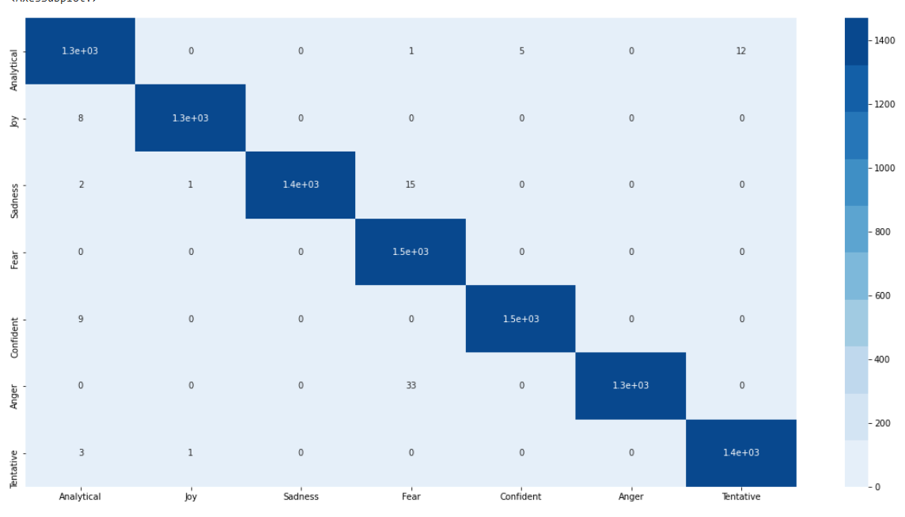
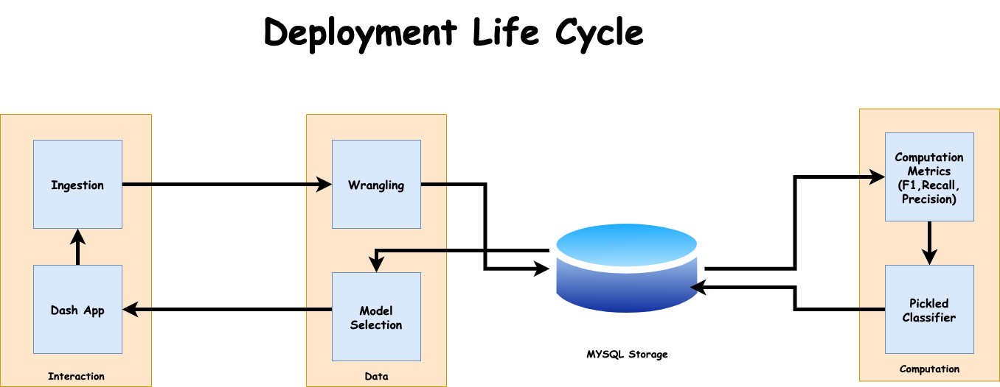
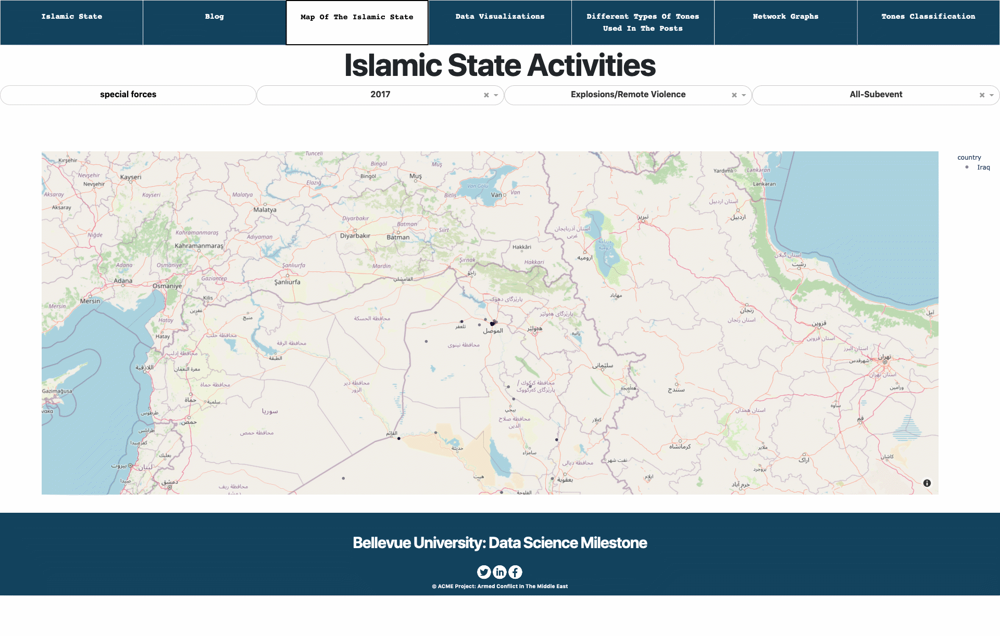

# Mining The Islamic State Posts (http://www.textminingdaesh.ml)
## **What is the Islamic State** 
The Islamic State of Iraq and the Levant (ISIL), also known as the Islamic State of Iraq and Syria, and its opponents refer in Arabic acronym as Daesh. ISIL was founded in 1999 by Abu Musab al-Zarqawi, a Jordanian jihadist who ran a terrorist training camp in Afghanistan. This organization pledged allegiance to al-Qaeda and participated in the Iraqi insurgency following the 2003 invasion of Iraq by the coalition forces. In June of 2014, the group renamed the organization as the Islamic State (ad-Dawalah al-Islamiyah الدولة الإسلامية). The Islamic Organization wants to claim religious, political, and military authority over all Muslims worldwide. 

## **Goal and Ideology**
The Islamic State's goal has been the foundation of a Sunni Islamic State and to conquer the world.  They will kill those who do not believe in the group's interpretation of the Quran. The Islamic State ideology follows the Salafi movement, which aims to return to the pure form of Islam and rely on the Quran, the Sunnah, and the Salafs' consensus alone and ignoring the rest of Islamic hermeneutic teachings. The organization uses end-time propaganda to recruit foreign fighters who want to travel to the lands where the apocalypse's final battles will occur. As a result, an estimated 15,000 foreign fighters from over 80 countries joined the organization in November 2014. In September 2015, 30,000 soldiers, including 3,400 foreign fighters from the Western world, joined the Islamic State. The Islamic State fighters rely mostly on captured weapons from Saddam Hussein's Iraqi stockpiles from the 2003 to 2011 Iraqi insurgency. Also, weapons from government and opposition forces fighting in the Syrian civil war and the U.S weapons captured from the Iraqi soldiers. 

## **Recruitment on social media** 
The Islamic State uses propaganda videos to recruit a new member. These propaganda videos consist of beheadings or mass shootings of the enemies of the Caliphate. Moreover, these propaganda videos have high production quality, including montages, slow motion scenes, and short dialogue. Between 2013 to 2014, the organization used social media platforms to spread its propaganda message using Twitter, Facebook, and YouTube. In 2014, many of the social media companies had decided to remove ISIS content. Therefore, they have chosen to utilize social media platforms to protect their content or allow for content to be reposted quickly. The Islamic State platforms of choice are Telegram, JustPasteIt, and Surespot.

#### **Twitter** 
Twitter had banned 46,000 to 90,000 accounts run by ISIS supporters in 2014 and banned additional 125,000 accounts in 2015. These accounts belong to the Baqiya family, an online network of thousands of ISIS followers. Also, these accounts were active during important ISIS military victories. For example, during the ISIS march on Mosul, Iraq.

#### **JustPasteIt** 
This platform allows anonymous users to send and receive content without registration. As a result, many ISIS members have shared photos of countless murders, execution, and battlegrounds onto the platform. 

#### **Telegram** 
Telegram is an end-to-end user encryption platform, and it has unique features such as the self-destruct timer, which will erase all evidence and messages. ISIS used this platform to plan social media campaigns on alternate platforms and often uses the hashtag #KhilafahNews to attract their users. 

#### **TikTok** 
In October 2019, two dozen accounts with the ISIS recruitment content were discovered and removed from the platform. 

## **Project Background**
The purpose of this milestone is to study how the Islamic State (Daesh) used Social Media not only to communicate, share or capture information but also to analyze social-political dynamics, describe events, model reality, influence choices, and behaviors. The Islamic State used Social Media to interfere with the adversaries' decision-making process, both directly, to manipulate their information and influencing their close collaborators, and indirectly by influencing groups of people. For instance, individuals, parties, or public opinion whose reaction can affect a country's leadership's very choices. On the wrong hand, Social Media can act as an influencer, propaganda, ideological radicalization, recruitment, communication, training, and deception tools. 
Furthermore, the Islamic State used Social Media such as Facebook, YouTube, and Twitter to recruit and increase the number of sympathizers and jihad-supporters, especially in the Western world. For example, spreading photos or videos of successful terrorist attacks, publishing lists and biographies of the martyrs, and preaching ideological text. Additionally, the Islamic State used Social Media platforms such as JustPasteIt for propaganda activities to make public successful terrorist attacks such as throwing the civilian population into unrest. Spreading propaganda through news or content on Social Media has a significant impact than those caused by the terrorist attacks themselves. Because Social Media can influence an individual's behavior and facilitate social interaction, leading to changes in attitudes and behavior over time, for instance, individuals can adopt new extremist ideas and materials that may lead to recruiting themself without outside influence. 

## Database Schema 

MySQL database has the following table structures
1. **justpasteit_posts**: this is the main table for this project to store all the raw documents/posts. Also, to keep other metadata from the website such as date created, number of views, and date modified.
2. **image_urls_justpasteit**: I used this table to store all the posts extracted by the Google OCR (Optical Character Recognition) and other attributes such as language and image URLs.
3. **translated_posts**: this is the lookup table between justpasteit_posts and image_urls_justpasteit.
4. **main_post_tone**: I used this table to store the tones, the probabilities scores, and sentiment polarity scores of the given post.
5. **embedded_image_tones**: After, I extracted all the text from the images. I translate the text (if it's not in English), calculate the tones, the sentiment polarity scores, and save it.
Furthermore, the MySQL database gives me the ability to query/search the database with some conditional statements. For example, I can search the posts written in Arabic from 2014 to 2016. But the only downside is that the MySQL relational database is relatively slow to retrieve all the encoded posts because the posts have at least five hundred words.
   

## Retrieving missing contents
JustPasteIt removed many of the Islamic State posts and images, but some of the contents were still available on the Internet and cached by search engines such as Google. Therefore, I used my Python program to retrieve those cached contents and store them inside the MySQL relational database. Additionally, Google has built-in functions that can help users to narrow down their search. 

## Storing non-English Characters
The post collected from the JustPasteIt website contains different languages such as Arabic, English, Italian, Japanese, and Turkish. Some of these languages, when stored inside the MySQL tables, caused MySQL to throw errors. Therefore, to preserve data integrity, I used base64 encoding to encode and decode the raw data safely. (Figure-A Shows the different types of languages used).
  

## Data Preparation

### Extracting Text 
For this milestone, I collected the raw data in three formats: HTML, JPEG/PNG (images), and PDF. I used the beautiful soup to obtain the text/content from an HTML document and the metadata contents embedded inside the JavaScript. Moreover, to get all the text/content from the images, I used Google optical character recognition (OCR), and to obtain the content from the PDF file, I used the Python pdf reader library. Additionally, the text embedded inside the images might contain radical messages or other messages worth looking at to build my language models. 

### Labeling Data 
To have a quick understanding of the overall contents and build my language models, I used the IBM Watson tone analyzer to label all the posts. Additionally, it helps categorize the point of view and understand the tones used in the 1st, 2nd, and 3rd points of view. For example, Islamic State supporters tend to use words that praise the organization, such as the Islamic State's lions, the soldier of the Caliphate, Caliph, and Mujahideen. On the other hand, the Islamic State opponents love to curse at the organization by referring to it as the dog of fire, Baghdadi's dogs, or Daesh. Additionally, Figure-B shows the relationship between the topics and the tones. For example, users who write about Baghdadi's dogs in a second-person perspective with an analytical sound. 

### Translating non-English document 
I used the Google Cloud API translation service to detect and translate all the posts/documents written in a different language other than English. 
Dealing With Imbalanced Class
On my data set, I have a lot of analytical and joyful tones. Therefore, I downsampled the data by choosing seven thousand random rows from each tone category. Furthermore, I used these labels as my dependent variable for my machine learning models. Although many algorithms in scikit-learns, such as random forest, offer a parameter to weight classes during the training to counteract the imbalance class's effect, the result is still below my expectation. 

## Modeling 
I used the original posts/news articles, tone scores, and sentiment polarity to build my tone classifier by converting all the text into TF-IDF vectors and convert the sentiment polarity and tones scores into a CSR matrix. Furthermore, I stacked the newly created TFIDF vectors and CSR matrix horizontally to create a new feature matrix (independent variables). 
To classify the original posts, I use the following algorithms: random forest classifier, multinomial Naïve Bayes classifier, and multi-layer perceptron classifiers. After, I have selected a set of machine learning algorithms to evaluate the posts from JustPasteIT. My next primary task is to create a test plan to evaluate the machine learning algorithms' models. The test plan aims to ensure that the evaluation provides realistic estimates of model performance on unseen data. Additionally, if a prediction model memorizes a data set, it will not do a good job estimating new examples. Therefore, I divided the data set into 80% training and 20% testing sets.

### Model Evaluation
To evaluate my model, I used the training set to train my initial set of models. I used the validation set to compare the performance of these models on unseen data. Additionally, comparing these models' performance on the validation set enables me to determine which algorithm generated the best model. Here are the accuracy scores from the two models (Note: model one has three features (original post, sentiment score, and tone scores) and model two has one attribute (text)):

Both model one and model two perform poorly; therefore, I created a new corpus by collecting additional data from Kaggle about religious text and the Islamic State tweets. For the second model, I only used the text feature. Here are my model accuracies: 

The other major component of my test plan is to choose the appropriate evaluation metrics to use during the testing; besides the accuracy score, I used the following evaluation metrics: f1, precision, and recall scores. Especially the f1-score because a high f1 score indicates that both the precision and recall are high. Here is the result of my test: 

Additionally, to visualize my random forest classifier's performance, I choose the confusion matrix because it is easy to interpret the result. For instance, each column of the matrix represents predicted classes, while each row represents the actual class. Overall, my random forest model did an excellent job in classifying the tones in news articles or JustPasteIt posts. Moreover, this model has an AUC score of 0.999948, which is close to one. Because I have seven categories of tones, therefore for my cross-validation method, I used a macro mode to calculate the mean of metric scores for each class by weighting each type equally. 

## Parameter Tunning
1. Random Forest Classifier: to improve the random forest classifier's performance, I used the RandomizedSearchCV to find the best maximum features and the number of estimators. This method is more efficient than the GridSearchCV because it searches over a specific number of random combinations of hyperparameter values from my random forest algorithm.
2. Multi-layer Perceptron: to improve the performance of the multi-layer Perceptron, I used the RandomizedSearchCV to find the best activations (identity, logistic, tanh), hidden layers ( ranges from 100 to 300), and the solver (lbfgs, sgd.).

## Deployment 
### Deployment Life Cycle
Besides requiring the selection and use of a fitted model, my deployment phase does not significantly differ from software development. During the build phase, my application ingested and wrangled the raw data into a form that allowed my machine learning models to be fitted and trained. During the deployment phase, I selected a model that performs well and use it to make estimations or predictions that directly take the user's input.

### Dash Application
I created a dash application that I hosted at http://textminingdaesh.ml to help me tell the history of the Islamic State organization and visualizing the data collected from the JustPasteIt website. Additionally, I created an interactive map that maps the Islamic State locations from 2015 to 2020. I also deployed my random forest classifier to my dash application to help classify news articles or posts and categorizing the tone in the news article/post into analytical, joyful, sadness, fear, confidence, anger, and tentative. For example, the graph below shows the locations related to the special forces and explosions in the Middle East.

